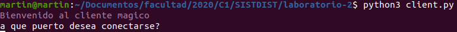
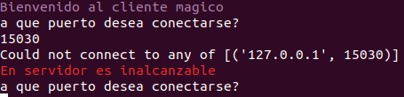
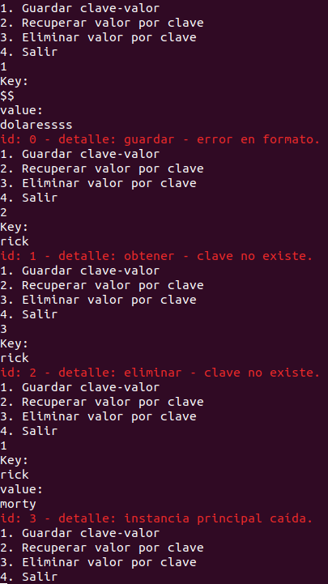
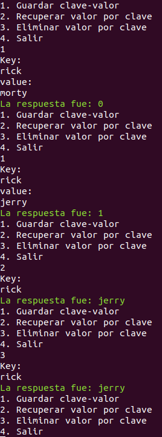
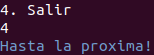

# Laboratorio 2 😎

- [Laboratorio 2 😎](#laboratorio-2-)
  - [Avances 🌱](#avances-)
  - [Integrantes 👦👧](#integrantes-)
  - [Vision 📖](#vision-)
  - [Requisitos ✋](#requisitos-)
  - [Comenzar 🚀](#comenzar-)
  - [Estructura del proyecto 👷](#estructura-del-proyecto-)
    - [App 🔀](#app-)
    - [Store 🏪](#store-)
      - [API del Almacenamiento clave-valor](#api-del-almacenamiento-clave-valor)
    - [Forwarding 🔄](#forwarding-)
  - [Archivo thrift](#archivo-thrift)
  - [Archivo docker-compose 🐳](#archivo-docker-compose-)
  - [Cliente mágico 🐍](#cliente-mágico-)

## Avances 🌱

Todos los avances y cambios del proyecto pueden ser vistos en el [changelog](./CHANGELOG.md).

## Integrantes 👦👧
- Nacimiento, Francisco Martin
- Senghaas, Evelin Yaneth

## Vision 📖
Este laboratorio consta de dos partes.
En la primera parte, se debe crear un almacenamiento de tipo clave-valor en un único sitio accesible
mediante RMI o RPC.
En la segunda parte, se debe crear un servicio que constará de varias instancias, donde la instancia
principal es el almacenamiento clave valor y todas las otras instancias procesan solicitudes mediante
el reenvío de las mismas a la instancia principal. 

## Requisitos ✋
- Docker
- Docker-compose
- Python
- Pip

## Comenzar 🚀
Para utilizar el proyecto usted debe:

- Clonar el repositorio.
- Una vez clonado el repo ejecuta en tu consola (bash) `sh init.sh`. Podes ir a prepararte tu bebida favorita, comida y mirarte un capitulo de tu serie hasta que el comando termine de preparar el proyecto.
- Una vez listo el proyecto ejecuta `docker-compose up --scale forwarding=3` para probarlo. Puede escalar el servicio de servidores de reenvío *forwarding* al numero que desee.
- Ahora que tiene listo el almacen clave-valor y los servidores de reenvío. Debe instalar con pip la dependencia de thrift con el siguiente comando `pip install -r requirements.txt`, debe tener en cuenta la version de pip que utilice, puede variar a `pip3` si tiene la version 3.
- Una vez finalizado la instalación, debe ejecutar `python client.py` para empezar a utilizar el cliente. Tenga en cuenta la version de python que utilice, por lo que puede variar el comando.
- Para una guiá de como utilizar el cliente, vea la sección del [cliente](#cliente-mágico-).

## Estructura del proyecto 👷
```
app/
    src/main/java/edu/unam/app
        forwarding/
        store/
        App.java
client.py
```
Dentro del directorio `app/src/` se encuentra toda la lógica del almacenamiento clave-valor en el directorio `store/` y la logica de los servidores de reenvío en el directorio `forwarding/`. El almacenamiento de clave-valor y los servidores de reenvío están implementados en el lenguaje **Java** ☕ y comunican a traves de **RMI**. Los servidores de reenvío y los clientes se comunican a traves de **Apache Thrift**, estando el cliente implementado en **Python** 🐍.

### App 🔀
El archivo `App.java` es el inicio del proyecto, en el se encuentra lo lógica para determinar si el proyecto se ejecuta como un almacén de clave-valor o como una servidor de reenvío, mediante el recibiendo o no de un parámetro, si recibe un parámetro debe ejecutarse como un servidor de reenvío, en caso contrario como un almacenamiento clave-valor.

### Store 🏪
La lógica del almacén clave-valor se encuentra en `/store/Store.java` en donde se implementa la interface de RMI `/store/StoreInterface.java`. Los métodos que deben implementar son `save` para guardar una clave y un valor, `get` para recuperar un valor mediante una clave y `delete` para borrar una clave y un valor mediante la clave. Para mas información, el proxima sección se muestra la API del almacenamiento.

#### API del Almacenamiento clave-valor

| Método | Parámetros   | Retorno      | Ejemplo          |
| ------ | ------------ | ------------ | ---------------- |
| save   | (key, value) | 0, 1, error  | save(key, value) |
| get    | (key)        | value, error | value = get(key) |
| delete | (key)        | value. error | delete(key)      |


`save(key, value)`:
  - si la clave no existe debe devolver 0.
  - si la clave existe debe devolver 1
  - si no se satisfacen los requerimientos sobre formato de clave o valor se genera una excepción
error con los valores: id = 0 y detalle = guardar - error en formato.

`get(key)`:
  - Si la clave no existe se genera una excepción error con los valores: id = 1 y detalle = obtener -
clave no existe.
  - Si la clave existe se devuelve el valor asociado a la clave.

`delete(key)`:
  - Si la clave no existe se genera una excepción error con los valores: id = 2 y detalle = eliminar -
clave no existe.
  - Si la clave existe se devuelve el valor asociado a la clave eliminada.

En las instancias de reenvió, en el caso de que la instancia principal se encuentre caída se debe
devolver una excepción error con los valores: id = 3 y detalle = instancia principal caída.

### Forwarding 🔄
La lógica de los servidores de reenvío se encuentra en `/forwarding/ForwardingHandler.java` el cual implementa la interface de Thrift `/forwarding/Forwarding.java`. `/forwarding/ForwardingServer` es el encargado de levantar el servidor y `/forwarding/Excep.java` maneja las excepciones, fue creado con thrift también.

## Archivo thrift
El archivo thrift del proyecto se encuentra en la raíz `/Forwarding.thrift`.
```thrift
# Para el cliente python se comenta la linea de abajo para generar los archivos thrift
namespace java edu.unam.app.forwarding

exception Excep {
	1: i32 id,
	2: string detail
}

service Forwarding {
	#Guardar clave y valor en el almacén
    i32 save(1: string key, 2: string value) throws (1: Excep e),

    #Recuperar un valor mediante su clave
    string get(1: string key) throws (1: Excep e),

    #Elimina una clave y valor mediante la clave
    string destroy(1: string key) throws (1: Excep e)
}
```
## Archivo docker-compose 🐳
El el archivo `/docker-compose.yml` puede encontrar información de como se encuentra construido el entorno de ejecución el proyecto.

## Cliente mágico 🐍
El cliente consiste en un CLI (Interface de Linea de Comandos) implementado con Python.

Cuando inicie el cliente lo primero que vera es:



Para saber que puertos tiene disponible puede utilizar el comando `docker ps` están dentro del rango de 15000-15100, pero debe ver los que estan disponibles ya que no todos están en escucha, depende a cuanto escalo el servicio *forwarding*.

En el caso de no dar con un puerto en escucha, no se preocupe, que sera informado y podrá volver a ingresar un puerto que si este en escucha:



Ingresando un puerto en escucha vera el siguiente menu:


Los errores que pueden tener durante la operación con el cliente son los siguientes:



Durante operaciones normales podrá ver las siguientes respuestas:



